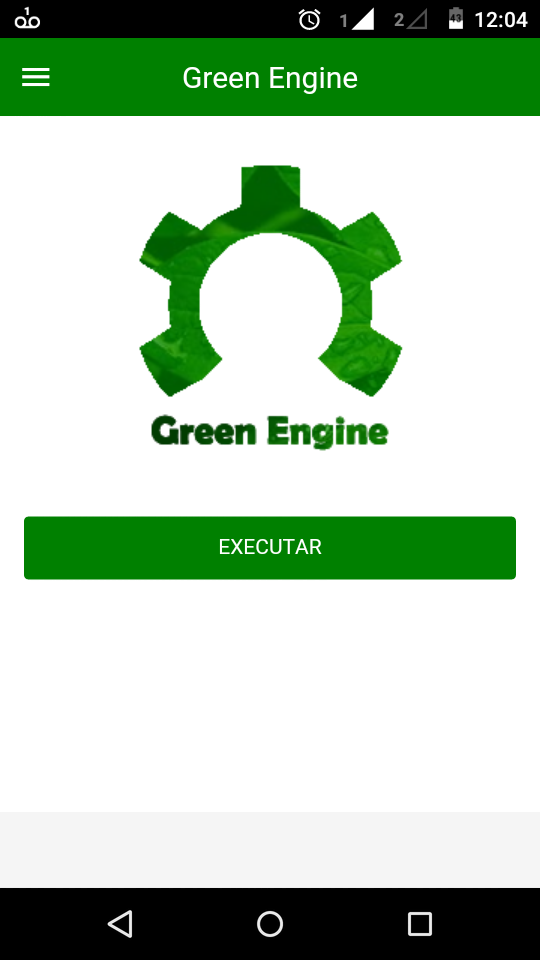

# GreenEngine App

Aplicativo **(Android)** que realiza a classificação do nı́vel de poluentes presentes em um motor utilizando técnicas classificatórias de inteligência artificial.

## Sobre

#### Técnicas Utilizadas

Utilizar técnicas classificatórias de aprendizagem de
máquina e de agrupamento, sendo elas a **rede neural artificial**, o **raciocı́nio baseado em casos** e o **k-means**, para determinar se um motor com determinadas especificações terá um
nı́vel de emissão de poluentes dentro do padrão. Isso permitirá que modificações sejam realizadas no motor para adequação em caso de nı́veis excedentes da concentração de um
poluente resultando assim na redução de poluentes.

#### Funcionamento

Foi desenvolvido também um vı́deo explicativo de todo o funcionamento e modo de uso deste aplicativo. Ele apresenta um passo a passo mostrando aquilo que é necessário em
cada etapa. O link do vı́deo está em    
      https://www.youtube.com/watch?v=rxssbRUi5G8

#### Download

É possı́vel também realizar o download do aplicativo para dispositivos android no site
      http://greenengine.esy.es/

